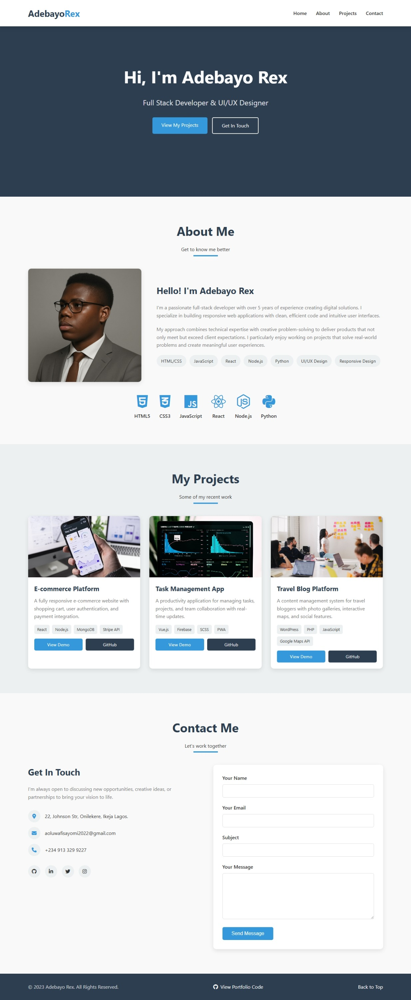

<h1 align="center">🌐 Adebayo's Portfolio Website</h1>

<p align="center">
  <a href="https://adebayo-makemoney.github.io/portfolio-website/"><strong>🌍 Live Demo</strong></a> •
  <a href="https://github.com/Adebayo-makemoney"><strong>👨‍💻 My GitHub</strong></a>
</p>

---

## 🧭 About the Project

This is my **personal portfolio website**, built to showcase my web development skills, projects, and creative work.  
It’s fully responsive, lightweight, and designed to leave a lasting impression on clients and recruiters.

---

## 🛠️ Built With

<p align="center">
  
</p>

- **HTML5** – structure and content  
- **CSS3** – layout, animations, and responsiveness  
- **JavaScript (Vanilla)** – interactivity and dynamic features  
- **Git & GitHub** – version control and deployment  

---

## 🎯 Features

✅ Clean, minimal, and modern design  
✅ Responsive layout for all devices  
✅ Interactive navigation and sections  
✅ Project cards with live and GitHub links  
✅ About section showcasing skills and tools  
✅ Contact section with social media links  

---

## 🖼️ Screenshot

<p align="center">
  
</p>

---

## 🚀 Getting Started

To run this project locally:

```bash
# Clone the repository
git clone https://github.com/Adebayo-makemoney/portfolio-website.git

# Navigate to project folder
cd portfolio-website

# Open in browser
start index.html
```

---

## 📁 Folder Structure

```
portfolio-website/
│
├── README.md
├── index.html
├── styles.css
└── script.js
```

---

## 🧠 Future Improvements

- Add a dark/light mode toggle 🌙  
- Include form backend with Netlify / EmailJS 📩  
- Integrate animations with AOS or GSAP ✨  
- Add blog section for insights & tutorials 📝  

---

## 📊 GitHub Stats

<p align="center">
  
  
</p>

---

## 🤝 Connect With Me

<p align="center">
  <a href="https://github.com/Adebayo-makemoney" target="_blank">
    
  </a>
  <a href="mailto:youremail@example.com" target="_blank">
    
  </a>
</p>

---

⭐ Don’t forget to star this repo if you like my work!  
Made with ❤️ by Adebayo-makemoney
